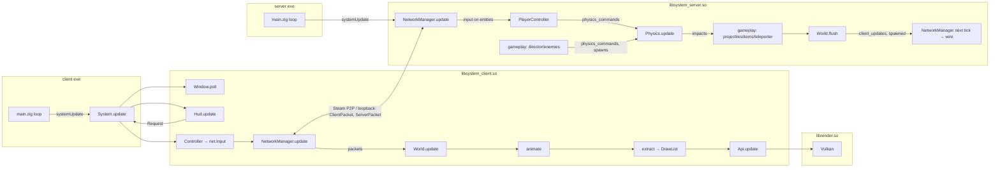

# Architecture

Co-op roguelike shooter on a walkable SDF planet. Server-authoritative over Steam
networking; client is a replicator + renderer. Everything gameplay-side is
hot-reloadable code in a `.so`; the executables are thin hosts.

## Packages

| Package | Builds | Role |
|---|---|---|
| `shared/` | module `shared` | The contract both sides compile: wire format (`net.zig`), entity spec rows (`entity.zig`, `entity/`), items (`Item.zig`), planet SDF + chunking + nav graph (`planet/`), Steam transport (`SteamNet.zig`, `steamNet/`), hot reload (`HotLib.zig`, `DynLib.zig`), log fn, tick constants. |
| `server/` | `server` exe, `libsystem_server.so` | Authoritative simulation. Host exe is a thin loop; the `.so` owns `System` + `World` and runs network → gameplay → physics → flush → replication. Optional `viewer/` (build option) draws the server world through the renderer. |
| `client/` | `client` exe, `libsystem_client.so` | Thin host exe; the `.so` replicates server state, runs input/camera/HUD/audio/animation, extracts a `DrawList` for the renderer. Spawns the server process for hosting. |
| `render/` | `librender.so` + modules `renderer_contract`, `graphics`, `ui`, `Window` | Vulkan renderer (shader objects, descriptor buffers, BDA) behind a C-ABI `Api` table; asset loading (`graphics/`), immediate-mode UI (`ui/`), native windowing (`window/`: Wayland, Xlib, Win32, Cocoa). |

## Modules

| Module | File(s) | Owns | Talks through |
|---|---|---|---|
| Client host | `client/src/main.zig` | gpa, window, `HotLib(system_client)`; loop is `trySwap → systemUpdate` | `system_contract.Api` (5 fns) |
| Client System | `client/src/System.zig` | client `World`, fixed-step `Clock` + fps, render `HotLib`, audio, assets, animator, particles, NetworkManager, Hud, scene | World (mailbox), DrawList |
| Client World | `client/src/World.zig` | replicated entities, dying list, damage events, camera/controller/chat/options, planet | packets in, read by extract/hud |
| Client NetworkManager | `client/src/system/NetworkManager.zig` | Steam client, server process spawning, `packets` inbox, tick estimate | `packets` list consumed by World/System |
| Hud | `client/src/system/Hud.zig`, `hud/` | screen/overlay state, UI context, damage popups | returns `Hud.Request` |
| extract | `client/src/system/extract.zig` | — | World → DrawList |
| Renderer | `render/vulkan/` | Vulkan device, swapchain, frame data, resources | `renderer_contract.Api` (C ABI, hot-reloaded inside the client System) |
| Server host | `server/src/main.zig` | gpa, args, viewer window, `HotLib(system_server)`; loop is `trySwap → systemUpdate` | `server/src/system_contract.zig` `Api` (5 fns) |
| Server System | `server/src/System.zig` | server `World`, fixed-step `Clock` + tick counter, NetworkManager, Physics, Viewer | World |
| Server World | `server/src/World.zig` | entities, players, spawn/despawn queues, physics command + impact queues, client_updates outbox, director, planet, navmesh, stage | `flush(physics)` is the one drain |
| Physics | `server/src/system/Physics.zig` | box3d world | `physics_commands` in, `impacts` out |
| gameplay | `server/src/gameplay/`: `combat`, `skills`, `stage`, `director`, `enemies`, `projectiles`, `items`, `teleporter`, `players` | — | free functions over `*World` (+ `*Physics` where they spawn bodies or raycast) |
| PlayerController | `server/src/gameplay/PlayerController.zig` | — | input → physics commands, interact, skills, dev keys |
| Navmesh | `server/src/system/Navmesh.zig` | flow field + worker thread | `direction()` queries |
| Server NetworkManager | `server/src/system/NetworkManager.zig` | Steam server, client table, motion dedup | `client_updates` + `spawned` → wire |

## Data flow

## Hot reload

- `shared/src/HotLib.zig` copies the `.so`, `dlopen`s the copy, resolves every
  field of the Api table by name, and swaps on mtime change
  (`reload(handle, true)` → swap → `reload(handle, false)`).
- Three hot libs: `system_client` (host: client exe), `render` (host: client
  System), `system_server` (host: server exe).
- Each `.so` allocates its whole persistent state (System, which holds World)
  in `systemInit` and hands the host an opaque handle; the host never sees a
  `.so`-defined layout. That state survives a swap and is reinterpreted by the
  new code, so each library exports `layoutHash` and `HotLib` refuses a build
  whose persistent layout differs (decision 0001).
- Tick policy (fixed step, sleep, stall warning, fps) lives in the `.so`
  (`shared/src/Clock.zig`), decision 0002.
